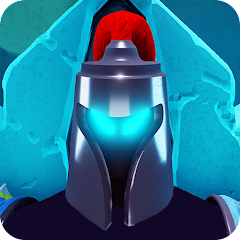
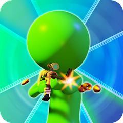
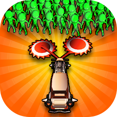
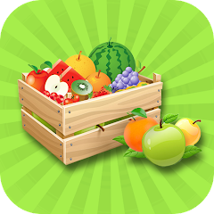
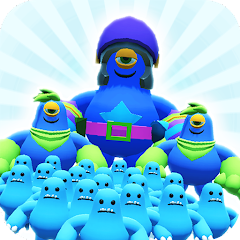
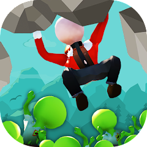
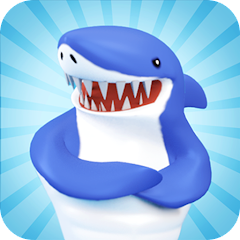

### Hi there 👋 

- 🔭 I’m currently working on Unity and Unreal Engine.
- 🌱 I’m currently learning well... basically everything i can.
- 💬 Ask me about anything, i will do my best to help :)
- 📫 How to reach me: 
- 😄 Pronouns: M'dude!
- 📜 Resume: [Take a look!](Resources/YagizAYER_Resume.pdf)
- ⚡ Fun fact: I can do this:  

------------------------    Play My Games!    ------------------------  

<table>
      <!--Dodge Attack!-->
      <tr>
          <td></td>
          <td>
            <b>Dodge Attack!</b> 
            <a href="https://play.google.com/store/apps/details?id=com.NanoGames.DodgeAttack">Play at Android Now!</a> 
            <i style="font-size:10px;color:gray;">Keywords: Unity mobile game, Action game, Fantasy theme, Precognition ability, Pattern memorization</i></td>
      </tr>
      <!--Trouble Bullet-->
      <tr>
          <td></td>
          <td>
            <b>Trouble Bullet</b> 
            <a href="https://play.google.com/store/apps/details?id=com.NanoGames.TroubleBullet">Play at Android Now!</a> 
            <i style="font-size:10px;color:gray;">Keywords: Unity mobile game, First-person shooter, Bullet curving mechanic, Criminal takedown missions, Environmental destruction</i></td>
      </tr>
      <!--Zombie Mower-->
      <tr>
      <td></td>
      <td>
            <b>Zombie Mower</b> 
            <a href="https://play.google.com/store/apps/details?id=com.NanoGames.ZombieMower">Play at Android Now!</a> 
            <i style="font-size:10px;color:gray;">Keywords: Unity mobile game, Zombie apocalypse theme, Vehicle combat, Obstacle anticipation, Resource management</i></td>
      </tr>
      <!--Backyard Farm-->
      <tr>
      <td></td>
      <td>
            <b>Backyard Farm</b> 
            <a href="https://play.google.com/store/apps/details?id=com.NanoGames.BackyardFarm">Play at Android Now!</a> 
            <i style="font-size:10px;color:gray;">Keywords: Unity mobile game, Farming simulator, Tile organization, Seed planting, Crop management</i></td>
      </tr>
      <!--Number Wars-->
      <tr>
      <td></td>
      <td>
            <b>Number Wars</b> 
            <a href="https://play.google.com/store/apps/details?id=com.NanoGames.NumberWars">Play at Android Now!</a> 
            <i style="font-size:10px;color:gray;">Keywords: Procedural Animations, Strategy game, Puzzle-solving, Army building, Boss battles</i></td>
      </tr>
      <!--Slip n' Flip-->
      <tr>
      <td></td>
      <td>
            <b>Slip n' Flip</b> 
            <a href="https://play.google.com/store/apps/details?id=com.NanoGames.SlipnFlip">Play at Android Now!</a> 
            <i style="font-size:10px;color:gray;">Keywords: Real-Time Spline Generation, Water slide acrobatics, Junk food power-ups, Mid-air tricks, Physics based</i></td>
      </tr>
      <!--ZClimb-->
      <tr>
      <td></td>
      <td>
            <b>ZClimb</b> 
            <a href="https://play.google.com/store/apps/details?id=com.NanoGames.ZClimb">Play at Android Now!</a> 
            <i style="font-size:10px;color:gray;">Keywords: Physics engine, Inverse kinematics, Animation masking, Procedural animation, Level editor</i></td>
      </tr>
      <!--Land Shark-->
      <tr>
      <td></td>
      <td>
            <b>Land Shark</b> 
            <a href="https://play.google.com/store/apps/details?id=com.NanoGames.LandShark">Play at Android Now!</a> 
            <i style="font-size:10px;color:gray;">Keywords: Physics engine, Artificial Intelligence, Procedural generation, Animation, Action gameplay</i></td>
      </tr>
</table>
